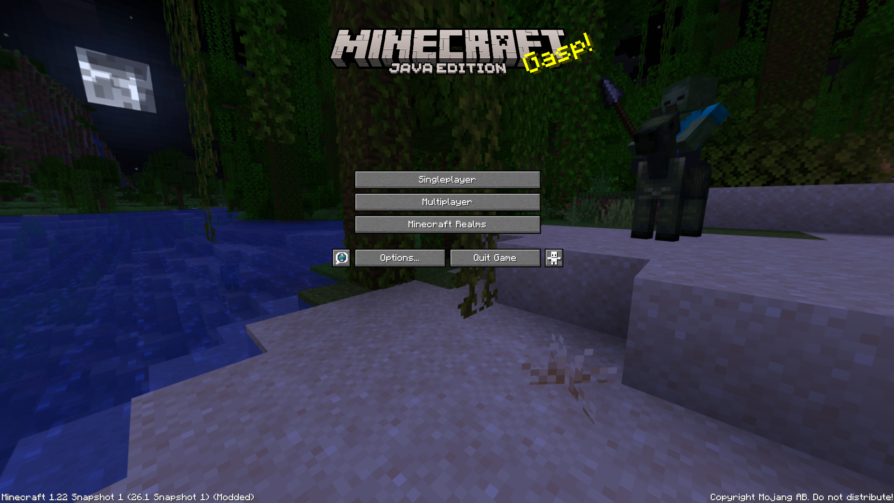

  
  <h1>Notch's Versioning</h1>

**Notch's Versioning** is a mod that restores the classic version numbering system used in Minecraft releases.

## What does it do?

Minecraft recently changed its versioning scheme from `<major>.<minor>.<patch>` (e.g., `1.21.1`) to `<year>.<drop>.<hotfix>` (e.g., `26.1.1`).

**Notch's Versioning** calculates and displays the "legacy" version number by continuing the count from **1.21** (the last version before the switch).

### The Logic
The mod treats every new **"Drop"** as a new minor update (1.x).

| Official Version | Logic | Legacy Version |
| :--- | :--- | :--- |
| **26.1** | The 1st drop after 1.21 | **1.22** |
| **26.1.5** | Hotfix remains the same | **1.22.5** |
| **26.2** | The 2nd drop | **1.23** |
| **26.2 Snapshot 1** | Snapshots are mapped too | **1.23 Snapshot 1** |
| **27.1** | Carries over drops from '26 | **1.xx** (calculated dynamically) |

This allows you to play the latest updates while keeping the nostalgic version numbers you are used to.

    

